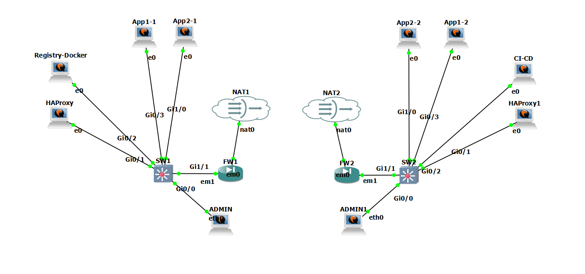

# ProTechServices - Highly Available Multi-Site Infrastructure

This project implements a highly available, multi-site IT infrastructure for ProTechServices, a growing IT services company looking to modernize its infrastructure to support national expansion.

## Overview

The infrastructure is distributed across two sites with a redundant architecture enabling high availability of critical services. The solution uses containerization, load balancing, and automation technologies to ensure rapid disaster recovery and smooth application deployment.

## Key Features

- **High Availability**: 24/7 service continuity with response time < 100ms
- **Disaster Recovery**: Automatic failover between sites in less than 15 minutes
- **Load Balancing**: Traffic distribution between sites via HAProxy
- **Containerization**: Applications deployed as Docker containers
- **Private Docker Registry**: Centralized and secure storage for Docker images
- **CI/CD Pipeline**: Deployment automation via Jenkins
- **Network Security**: Segmentation via VLANs and isolation between sites
- **OSPF Routing**: Optimized communication between sites

## Documentation

Detailed documentation is available in the [documentation](documentation/) directory:

- [Architecture Overview](documentation/architecture.md)
- [High Availability Strategy](documentation/high-availability.md)
- [Security Measures](documentation/security.md)

## Project Structure

- `/documentation` - Detailed architecture documentation
- `/configs` - Configuration files for various services
- `/scripts` - Deployment and automation scripts
- `/diagrams` - Infrastructure diagrams and schematics
- `/tests` - Testing scripts for high availability and load balancing

## Technologies Used

- **Networking**: Cisco IOSLv2 switches, OPNsense firewalls, OSPF routing
- **Containerization**: Docker, private Docker Registry
- **Load Balancing**: HAProxy
- **CI/CD**: Jenkins
- **Virtualization**: QEMU/KVM

## Author

0xSaaki

## License

This project is licensed under the MIT License - see the LICENSE file for details.
